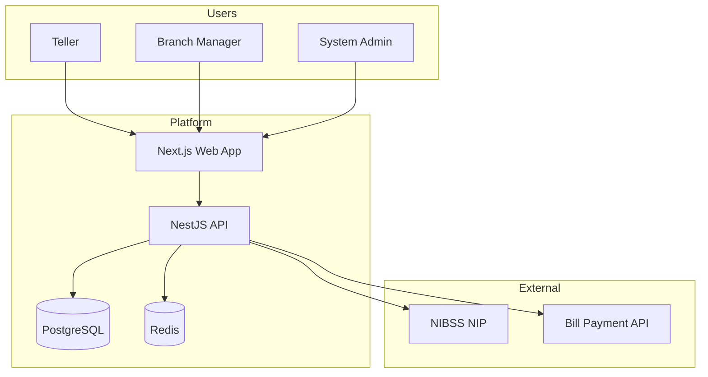
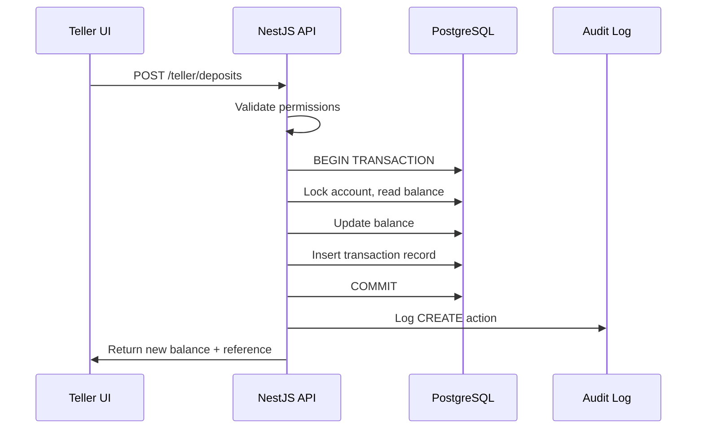
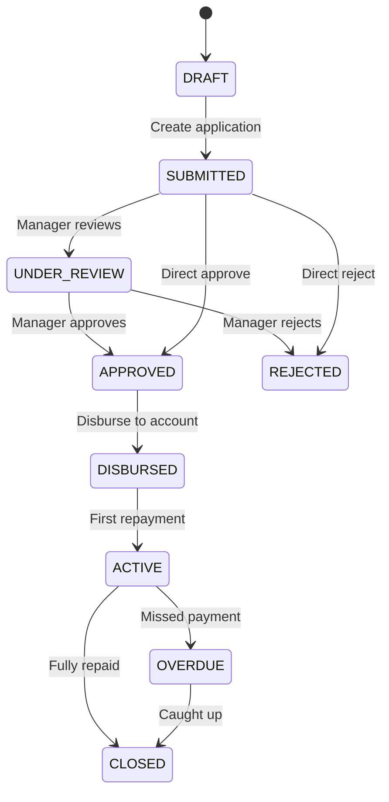

# Tanjuriel MFI — Architecture Blueprint

## System Context

This platform serves three primary user personas within a microfinance institution:



## Security Architecture

### Authentication Flow

1. User submits credentials to `POST /api/v1/auth/login`
2. API validates bcrypt hash, issues JWT access token + refresh token
3. Frontend stores tokens in localStorage, attaches Bearer token to all requests
4. On 401, frontend auto-refreshes via `POST /api/v1/auth/refresh`
5. Logout invalidates refresh token server-side

### Authorization Layers

```
Request → ThrottlerGuard → JwtAuthGuard → PermissionsGuard → Controller
```

- **ThrottlerGuard**: 100 requests/minute per IP
- **JwtAuthGuard**: Validates JWT, extracts user payload
- **PermissionsGuard**: Checks role-permission mapping from `@tanjuriel/shared`
- **RolesGuard**: Optional role-level restriction (ADMIN, MANAGER, TELLER)

### Audit Trail

Every mutating API call is intercepted by `AuditInterceptor`:
- Captures action type, entity, user, IP, user agent
- Stores old/new values as JSON
- Login/logout/approval events logged explicitly in service layer

## Data Flow — Teller Transaction



## Loan Approval Workflow



Each state transition creates a `LoanApproval` record with actor, action, and comment.

## NIBSS Integration Pattern

The integration layer follows an adapter pattern:

1. **Initiate**: Create `NibssTransaction` record with status `INITIATED`
2. **Call**: POST to NIBSS API (or return sandbox mock if unconfigured)
3. **Persist**: Update record with response code, session ID, raw response
4. **Return**: Standardized response to frontend

This ensures every external call is traceable regardless of success/failure.

## Frontend Architecture

### Route Structure by Role

| Route Pattern | Roles | Purpose |
|--------------|-------|---------|
| `/dashboard` | All | Real-time metrics |
| `/teller/*` | Teller | Customer & transaction ops |
| `/manager/*` | Manager, Admin | Loan & portfolio ops |
| `/admin/*` | Admin | System administration |
| `/integrations/*` | Manager, Admin | NIBSS & external services |
| `/reports` | Manager, Admin | Financial reporting |

### Component Hierarchy

```
DashboardLayout
├── Sidebar (role-filtered navigation)
├── Header (title, search, notifications)
└── Page Content
    ├── StatCard (metric tiles)
    ├── Card (content containers)
    └── Forms (Input, Select, Button)
```

## Scalability Considerations

| Concern | Current Approach | Future Enhancement |
|---------|-----------------|-------------------|
| Session management | JWT + refresh tokens in DB | Redis session store |
| Real-time dashboard | Polling on page load | WebSocket/SSE push |
| Report generation | Synchronous queries | Background job queue (Bull) |
| NIBSS callbacks | Polling status | Webhook endpoint |
| Multi-branch | Branch ID on all entities | Branch-level data isolation middleware |
| File uploads (KYC) | URL fields on Customer | S3/MinIO object storage |

## Environment Variables

See `.env.example` for the complete list. Critical production variables:

- `DATABASE_URL` — PostgreSQL connection string
- `JWT_SECRET` — 256-bit secret for token signing
- `NIBSS_*` — NIBSS sandbox/production credentials
- `CORS_ORIGIN` — Allowed frontend origin
